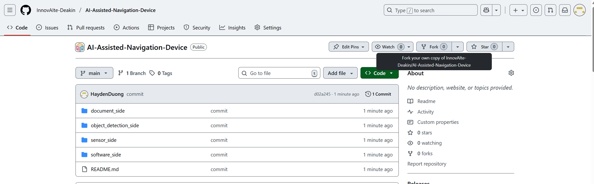

# AI Assisted Navigation Device as of Feb 2026

## Project Overview
This project aims to develop an AI-assisted navigation system to support visually impaired users, with a focus on complex indoor environments (e.g., university campuses). The prototype combines fast, sensor-driven (via phone tech) obstacle awareness with camera/ML-driven scene understanding (object and text recognition), so guidance can be both immediate (safety) and contextual (navigation meaning).

We treat privacy as a core requirement. The intent is to minimise data collection and avoid unnecessary retention, with a preference for on-device or local processing wherever practical.

## Repository Structure (main branch)
Top-level folders on the `main` branch:

### `Hardware_side/`
Hardware and embedded work for the physical device/sensor stack.
- Microcontroller code
- Wiring / BOM references
- Sensor integration notes

### `ML_side/`
Machine learning and vision/NLP work used by the system.
- Model experiments and training artefacts
- Inference tooling and integration helpers
- Anything related to object detection / OCR / LLM usage for the prototype

Important: large model binaries must not be committed to git (see “Model files policy” below).

### `software_side/`
The software application layer that integrates components and delivers the end-user experience.
- Frontend/mobile/web app code
- Backend/services (where applicable)
- Integration glue between hardware + ML outputs

### `Documentation_side/`
Project documentation and deliverables.
- Proposals, reports, meeting notes
- Architecture diagrams / specs
- Research notes and references

## Model files policy (do not commit)
Do not commit large model files or local adapters to the repository.

Examples of files that should stay local:
- `.gguf` model binaries
- local adapter folders
- large checkpoints / datasets

If you see these appearing under “Untracked files” in `git status`, add ignore rules and keep them on disk only.

Suggested `.gitignore` entries (adjust paths to match your local layout):
- `**/*.gguf`
- `**/models/`
- `**/adapters/`

## Collaboration Guidelines (fork workflow)
We use a fork-based workflow:

- `origin` → your personal fork (where you push branches)
- `upstream` → the group repository (where PRs are merged)

### One-time setup
Clone your fork, then add upstream:

- `git clone <your-fork-url>`
- `cd AI-Assisted-Navigation-Device`
- `git remote add upstream https://github.com/InnovAIte-Deakin/AI-Assisted-Navigation-Device.git`
- `git remote -v`

### Day-to-day workflow (development work)
- Sync your local `development` with upstream:
  - `git checkout development`
  - `git fetch upstream`
  - `git merge upstream/development`
- Create a feature branch from `development`:
  - `git checkout -b <area>-<task>-<name>`
- Commit changes and push to your fork:
  - `git push origin <your-branch>`
- Open a PR into `upstream/development`

### Merging policy
- Only integration leads merge into:
  - `development` (after review/approval)
  - `main` (stable releases only)

Backup of the Readme Prior to the end of T3 ending in Feb 2026
________
## Project Overview
This project aims to develop an AI-assisted navigation device for visually impaired individuals, specifically designed for navigating complex indoor environments like university campuses. Our goal is to create a functional proof-of-concept that combines the strengths of sensor technologies for real-time obstacle avoidance with camera-based AI for high-level object and text recognition.

This dual-system approach allows our device to provide comprehensive guidance: immediate feedback on physical obstacles and enriched contextual information about the environment. We are committed to addressing the ethical challenges associated with camera use by implementing strict privacy protocols, such as on-device processing and data minimization.

## Project Structure
The project is structured into four main components, each housed in a dedicated folder:

### `object_detection_side/`
This folder is dedicated to the research, development, and implementation of the camera-based AI features. This component provides the "contextual awareness" for the device by handling complex tasks like object and text recognition.

**Purpose:** To handle complex tasks like object and text recognition.

**Key Responsibilities:**
- Implementing AI models for object detection (e.g., identifying chairs, doors, bookshelves)
- Developing text recognition (OCR) functionalities
- Training and fine-tuning models on relevant datasets

**Note:** Our final prototype will utilize a camera for these functions. We are committed to ethical data handling practices, such as on-device processing, to protect user privacy.

### `sensor_side/`
This folder contains all the code and documentation for the low-level micro-controller that reads raw data from the physical sensors. This component is responsible for providing quick, real-time data for immediate obstacle avoidance.

**Purpose:** To acquire and pre-process data from various sensors (e.g., ultrasonic sensors, IMU module).

**Output:** Transmits processed sensor data to the `software_side` for higher-level analysis.

### `software_side/`
This is the core "brain" of the device. This folder contains the high-level logic that integrates input from both the `sensor_side` and `object_detection_side` to provide a unified and intelligent navigation experience.

**Purpose:** To fuse data from both sensor types, run final algorithms, and manage the user feedback system.

**Key Responsibilities:**
- Implementing data fusion algorithms from sensors and camera
- Controlling the haptic (vibration motor) and auditory (buzzer) feedback based on the fused data
- Integrating text-to-speech (TTS) services to vocalize recognized text
- Managing device configuration and overall system logic

### `document_side/`
This folder holds all project documentation, including research papers, design documents, meeting minutes, and the project proposal.

**Purpose:** To serve as a central repository for all project-related information, ensuring transparency and knowledge sharing.

**Contents:**
- Project proposals, research, and reports
- System architecture diagrams and flowcharts
- Meeting notes
- User story documentation

## Collaboration Guidelines
To ensure a smooth and organized workflow, all team members must follow these guidelines.

---

### Repository Setup: `origin` vs `upstream`
We use a **fork-based workflow**:

- **origin** → Your personal fork of the **group repository**  
  (the repository under your GitHub username, where you push your work)
- **upstream** → The main **group repository**  
  (the official repo with the `development` branch everyone merges into)

This setup ensures:
- You have full control over your own fork.
- You can keep your fork updated with the latest changes from the main repository.

---

### One-Time Setup
Click "Fork" button,, on group Github page: https://github.com/InnovAIte-Deakin/AI-Assisted-Navigation-Device.git
After forking the main repository to your own GitHub account:

1. **Clone your fork locally**  
   - git clone that fork Github to local.
   - Example: git clone https://github.com/HaydenDuong/AI-Assisted-Navigation-Device.git
   - cd REPO_NAME

2. **Add the `upstream` remote (main group repository)**
   - `git remote add upstream https://github.com/InnovAIte-Deakin/AI-Assisted-Navigation-Device.git`
   - `git remote -v`
   - Example output:
      origin  https://github.com/HaydenDuong/AI-Assisted-Navigation-Device.git (fetch)
      origin  https://github.com/HaydenDuong/AI-Assisted-Navigation-Device.git (push)
      upstream        https://github.com/InnovAIte-Deakin/AI-Assisted-Navigation-Device.git (fetch)
      upstream        https://github.com/InnovAIte-Deakin/AI-Assisted-Navigation-Device.git (push)

### Typical Workflow

1. **Sync your local `development` branch with upstream `development` branch:** 
   - `git checkout development`
   
   - **Option A: Fetch & Merge (Recommended for reviewing changes):**
       - Fetch the latest changes without merging: git fetch upstream
       - Review the changes, then merge them into your local branch: git merge upstream/development

   - **Option B: Pull (Simple and direct)**
       - Caution: Assuming there is no merge conflict between your local and the company files
       - Fetch and merge in one step: git pull upstream development

2. **Create a new feature branch from `development` in your local:**
   - Suggestion for branch naming: (side)-(task_description)-(your_name)
   - Example: software-implement_haptic_feedback-hayden
   - Example: `git checkout -b software-implement-haptic_feedback-hayden`

3. **Make your changes and commit:**
   - Suggestion:
      - `feat: add haptic feedback control`
      - `fix: resolve sensor data parsing issue`

4. **Push your branch to your fork(origin)**
   - Example: `git push origin software-implement_haptic_feedback-hayden`

5. **Create a Pull Request (PR) to `upstream/development`**
   - Go to your fork Github after pushed the branch in step 4.
   - Click `Compare & pull request`.
   - Ensure that the base repository is `InnovAIte-Deakin/AI-Assisted-Navigation-Device` and base branch is `development`.
   - Suggestion for PR Title Format: [PR] (side)(What you did)(Your Name): Short description
   - Example: [PR] (software)(Haptic Feedback)(Hayden): Added basic haptic feedback logic.
   - Click `Create pull request` and done.

### Merging Policy
Only the Code-Integration Leaders merges into:
   - `development`: After PR approval.
   - `main`: Only for stable releases after full testing.
`main` always represents production-ready code.
